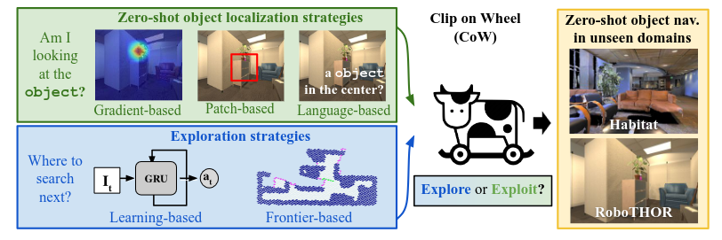

# [Clip on Wheels](https://arxiv.org/pdf/2203.10421v1)

https://github.com/Ram81/goat-bench

$\texttt{Clip on Wheels}$ (https://arxiv.org/pdf/2203.10421v1) is a baseline for Zero-Shot Object Navigation which uses CLIP and Grad-CAM, with a frontier-based exploration module to search either from image queries, text description or object categories.

<figure>
    
    <figcaption>From the article.</figcaption>
</figure>
