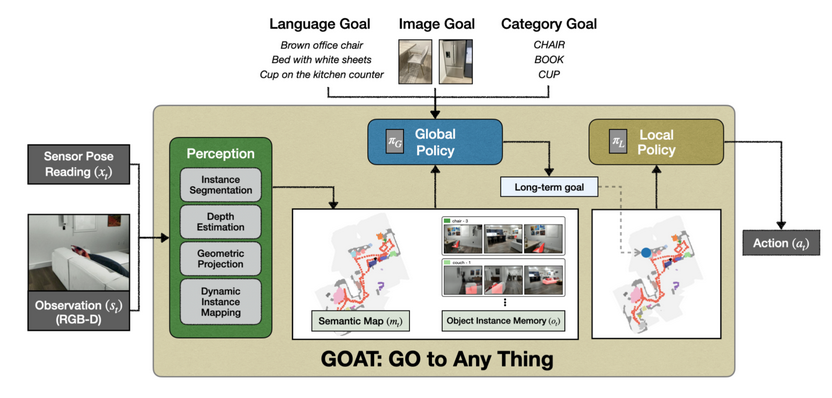
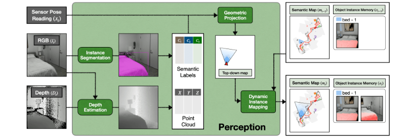

# [Modular-GOAT](https://arxiv.org/pdf/2311.06430)

https://github.com/Ram81/goat-bench

$\texttt{Modular-GOAT}$ (https://arxiv.org/pdf/2311.06430) is a baseline introduced for the benchmark GO To Any Thing, a multimodal lifelong object navigation task. The baseline is a zero-shot architecture with exploration is handled by FBE, and the method does not require extra fine tuning.

<figure>
    
    <figcaption>From the article.</figcaption>
</figure>

<figure>
    
    <figcaption>From the article.</figcaption>
</figure>


```
# Prepare config files 
cp -r projects/mod_GOAT/configs/benchmark third_party/habitat-lab/habitat-lab/habitat/config
cp -r projects/mod_GOAT/configs/habitat third_party/habitat-lab/habitat-lab/habitat/config
cp -r projects/mod_GOAT/configs/default_structured_configs.py third_party/habitat-lab/habitat-lab/habitat/config/default_structured_configs.py
cp -r projects/mod_GOAT/tasks third_party/habitat-lab/habitat-lab/habitat/
cp -r projects/mod_GOAT/datasets third_party/habitat-lab/habitat-lab/habitat/
ln -s $HABITAT_DATA/scene_datasets/hm3d_v0.2 $HABITAT_DATA/scene_datasets/hm3d
```